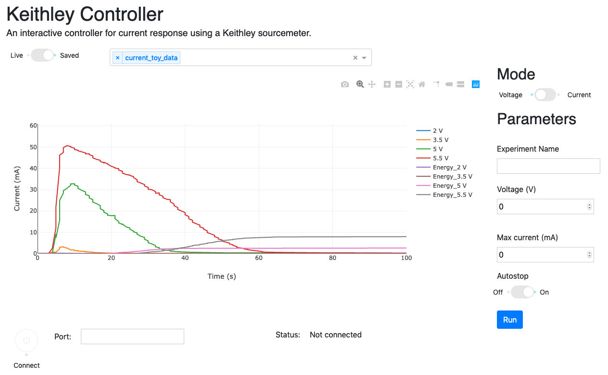

# KeithleyDashboard
Simple DASH-based dashboard to control and monitor current response to a voltage input using a Keithley 2400 Sourcemeter.

This app is still undergoing development and should not be used in production.



## Installation

Clone the repository to your computer 

```
git clone https://github.com/hlgirard/KeithleyDashboard.git
```

## Usage

Launch the dash app

```
cd KeithleyDashboard
python app.py
```

## License

This project is licensed under the GPL-3.0 License - see the [LICENSE.md](LICENSE.md) file for details.